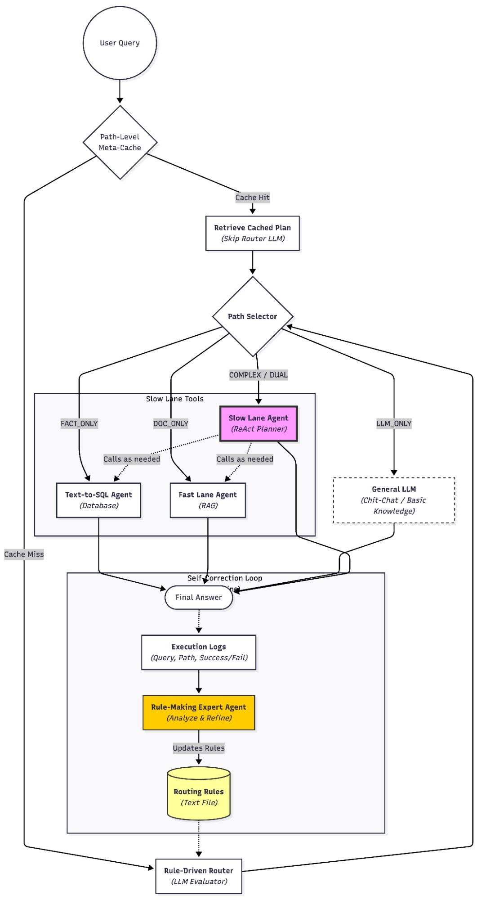

# Router Agent

The Router Agent is the orchestration layer of the Agentic Data Orchestrator system. It receives every incoming user query, decides which execution path best fits it, dispatches the query to the appropriate agent or tool, and logs the results to drive continuous rule improvement. It is the single entry point that connects the RAG Agent, Text-to-SQL Agent, and a direct LLM path into one unified interface.

---

## Table of Contents

1. [Architecture Overview](#architecture-overview)
2. [Routing Logic](#routing-logic)
3. [Execution Paths](#execution-paths)
4. [Tool Layer](#tool-layer)
5. [Self-Improving Routing Rules](#self-improving-routing-rules)
6. [Observability and Logging](#observability-and-logging)
7. [Integration: Importing Sibling Agents](#integration-importing-sibling-agents)
8. [Configuration](#configuration)
9. [Setup and Running](#setup-and-running)
10. [Testing](#testing)
11. [Project Structure](#project-structure)

---

## Architecture Overview



Every user query passes through the following stages:

**1. Path-Level Meta-Cache** — Before touching the LLM, the router checks a meta-cache keyed by query path patterns. On a cache hit, the previously computed routing plan is retrieved and the router LLM call is skipped entirely, saving latency on repeated query types.

**2. Rule-Driven LLM Router** — On a cache miss, the `LLMRouter` evaluates the query against the current `routing_rules.yaml` using an LLM (GPT-4.1-mini at temperature 0). The LLM scores the query across four paths (0–10) and returns structured JSON. The highest-scoring path wins; ties are broken by a fixed priority order (`complex_dual > doc_only > fact_only > llm_only`).

**3. Path Selector** — Dispatches the query to the selected execution path.

**4. Execution** — The appropriate agent or tool processes the query and returns an answer.

**5. Execution Logs → Rule-Making Expert Agent** — Every query result (query text, selected path, success/failure) is written to a structured JSONL log. A Rule-Making Expert Agent periodically analyzes these logs to identify misrouting patterns and refines the `routing_rules.yaml`, completing the self-improvement loop.

---

## Routing Logic

The `LLMRouter` in `src/router/llm_router.py` implements rule-driven LLM scoring. Routing is deterministic (`temperature=0.0`) and uses JSON mode to guarantee parseable output.

### Routing prompt

The router system prompt injects the current rules from `routing_rules.yaml` as a numbered list and instructs the LLM to score each of the four paths from 0–10 using an additive point system. Rules are designed to accumulate — a query can match multiple rules, and scores add up accordingly. The LLM returns:

```json
{
  "llm_only": 0,
  "fact_only": 6,
  "doc_only": 3,
  "complex_dual": 3,
  "reasoning": "Query requests specific numbers from structured data."
}
```

### Current routing rules (v1.0)

The initial rule set is based on Figure 7 of the "Learning to Route: A Rule-Driven Agent Framework for
Hybrid-Source Retrieval-Augmented Generation" paper. All rules carry equal weight (+3 points) in the initial version:

| Rule | Condition | Path awarded |
|---|---|---|
| RULE_1 | Requests numbers, percentages, years, or calculations | `fact_only` |
| RULE_2 | Contains "how", "why", "where", or asks for process/explanation | `doc_only` |
| RULE_3 | Asks for a definition or general knowledge | `llm_only` |
| RULE_4 | Has multiple requirements (both data and explanation) | `complex_dual` |

Rule weights are updated by the Rule-Making Expert Agent as routing data accumulates. The `scoring_instructions` block in the YAML explains the additive scoring model to the LLM.

### Tiebreaker

When two or more paths share the highest score, a fixed priority order resolves the tie:

```
complex_dual > doc_only > fact_only > llm_only
```

This conservatively prefers the more capable path when the query's needs are ambiguous. All tie decisions are logged with a `TIE DETECTED` flag for analysis.

### Error fallback

Any JSON parse error or LLM call failure results in a safe fallback to `complex_dual` with a confidence score of 0.5 and an error message appended to the reasoning. The system never crashes on a routing failure.

---

## Execution Paths

The four execution paths map directly to the agents and tools available in the system:

### `FACT_ONLY`
Routes to the **Text-to-SQL Agent** (`SQLTool`). Used for queries that require specific numbers, statistics, counts, or data points from the Oracle manufacturing databases (PRIMARY_DATABASE / LINKED_DATABASE). The SQL tool runs the full four-phase pipeline: profiling → schema linking → Algorithm 1 → candidate voting.

### `DOC_ONLY`
Routes to the **Fast Lane RAG Agent** (`RAGTool`). Used for queries requiring qualitative information: definitions, policies, process descriptions, technical explanations. The RAG tool runs hybrid retrieval with optional reranking and returns a cited, streamed answer.

### `COMPLEX_DUAL`
Routes to the **Slow Lane Agent** (`SlowLaneWrapper`) with access to both the `RAGTool` and `SQLTool` via the `LangGraphToolWrapper`. The Slow Lane's LangGraph ReAct planner decomposes the query into sub-questions, calls the appropriate tool for each, validates the evidence through a critic node, and synthesizes a final answer. This path handles queries that need both structured data from the database and contextual explanation from documents.

### `LLM_ONLY`
Bypasses all specialized agents and answers directly with the LLM's general knowledge. Used for chit-chat, common knowledge questions, and definitions that do not require the manufacturing knowledge base or live database data.

---

## Tool Layer

The tool layer (`src/tools/`) provides standardized async wrappers around the sibling agents.

### `BaseTool` interface

All tools implement the same interface:

```python
class BaseTool(ABC):
    def name(self) -> str: ...
    def description(self) -> str: ...
    async def run(self, query: str) -> ToolResponse: ...

@dataclass
class ToolResponse:
    answer: str
    success: bool
    metadata: Dict[str, Any]
    error: str = ""
```

### `RAGTool`

Wraps the RAG Agent's `FastLane.invoke_tool()` (non-streaming tool mode). Initialization is lazy — the Fast Lane agent is not loaded until the first RAG query arrives, avoiding unnecessary resource consumption when only SQL paths are needed. Returns the generated answer, citation indices, and retrieved context chunks.

### `SQLTool`

Wraps the Text-to-SQL Agent's `VotingOrchestrator.solve()`. Reads dual-database connection credentials from the router's `.env` (which mirrors the text-to-sql agent's connection config). Also uses lazy initialization. Returns the final SQL, the executed result as a formatted answer, and row count metadata.

### `LangGraphToolWrapper`

Bridges the `RAGTool` and `SQLTool` to the Slow Lane's LangGraph agent interface. Exposes two async methods — `rag_search()` and `sql_query()` — that conform to the signature expected by the Slow Lane's executor node. Gracefully handles cases where one tool is unavailable (e.g., if only the RAG agent is deployed) while still allowing the Slow Lane to run with the available tools.

---

## Self-Improving Routing Rules

The router is designed to improve its routing accuracy over time without manual intervention.

Every query execution writes a structured log entry containing the query text, selected path, success/failure flag, answer length, and any error message. These logs accumulate in `logs/router_YYYYMMDD.jsonl`.

The **Rule-Making Expert Agent** (referenced in `routing_rules.yaml` and the architecture diagram) periodically reads these execution logs, identifies patterns where the selected path failed or produced low-quality answers, and proposes updates to the scoring rules and weights in `routing_rules.yaml`. When the rules file is updated, the `LLMRouter` reloads it on its next initialization, completing the feedback loop.

The current rule set (v1.0) uses equal weights (+3 for each rule). As the rule-making agent analyzes more routing decisions, it can assign differentiated weights to rules and add new domain-specific rules learned from the manufacturing query patterns.

---

## Observability and Logging

`RouterLogger` in `src/utils/logger.py` writes all routing events to a daily-rotating JSONL file using async I/O (`aiofiles`) to avoid blocking the event loop.

Four event types are logged:

| Event type | Trigger | Key fields |
|---|---|---|
| `routing_decision` | Every routing call | `query`, `scores`, `selected_path`, `reasoning` |
| `result` | After execution completes | `query`, `path`, `success`, `answer_length`, `has_error` |
| `tool_call` | Each individual Slow Lane tool call | `tool_name`, `query`, `success`, `latency_ms` |
| `error` | Any exception during routing or execution | `message`, `context` |

Log entries are newline-delimited JSON, making them directly consumable by log aggregators, analysis scripts, and the Rule-Making Expert Agent.

---

## Integration: Importing Sibling Agents

The Router Agent imports classes from the `rag_agent` and `text_to_sql_agent` directories at runtime rather than installing them as packages. Both use `src.*` as their internal import root, which causes namespace collisions when both are imported into the same Python process.

The solution used in `rag_tool.py` and `sql_tool.py` is to:
1. Clear all cached `src.*` modules from `sys.modules` before each import
2. Temporarily prepend the target agent's directory to `sys.path`
3. Import the required classes
4. Restore the normal import environment

This approach avoids modifying either agent's codebase and is the only practical solution when the external codebases cannot be changed.

**Important:** Test scripts for the tools must be run as modules from the project root to ensure correct path resolution:

```bash
# From Agentic-Data-Orchestrator/ root
python -m router_agent.scripts.test_rag_tool
python -m router_agent.scripts.test_sql_tool
```

Running the scripts directly (`python scripts/test_rag_tool.py`) will cause import failures due to relative path resolution differences.

The SQL tool also requires loading both the `router_agent/.env` (for `LLM__AZURE_ENDPOINT` and `LLM__AZURE_API_KEY`) and the `text_to_sql_agent/.env` (for `AZURE_OPENAI_ENDPOINT` and related Oracle connection strings). Both are loaded explicitly at the top of the SQL tool module.

---

## Configuration

Settings are managed through `src/config/settings.py` using Pydantic Settings.

### Required environment variables

```env
# Azure OpenAI (for router LLM)
LLM__AZURE_ENDPOINT=https://your-resource.openai.azure.com/
LLM__AZURE_API_KEY=...
LLM__AZURE_API_VERSION=2024-10-01-preview

# Oracle databases (passed through to SQL tool)
PRIMARY_DSN=your-oracle-dsn
PRIMARY_USER=...
PRIMARY_PASSWORD=...
LINKED_DSN=your-oracle-dsn
LINKED_USER=...
LINKED_PASSWORD=...
```

### Key configuration parameters

| Setting | Default | Description |
|---|---|---|
| `router_model` | `gpt-4.1-mini` | LLM model for routing decisions (fast, cheap recommended) |
| `router_temperature` | `0.0` | Temperature for routing (0 = deterministic) |
| `router_max_tokens` | `500` | Max tokens for routing response |
| `routing_rules_path` | `config/routing_rules.yaml` | Path to routing rules file |
| `log_dir` | `logs` | Directory for JSONL log files |
| `PRIMARY_DB_NAME` | `PRIMARY_DATABASE` | Primary Oracle database name |
| `LINKED_DB_NAME` | `LINKED_DATABASE` | Linked Oracle database name |
| `LINKED_SUFFIX` | `@LINKED_DATABASE` | Database link suffix for cross-DB queries |
| `DB_TYPE` | `oracle` | Database type (oracle, postgres, mysql) |
| `USE_DOCKER` | `false` | Rewrites `127.0.0.1` → `host.docker.internal` in DSNs |

---

## Setup and Running

### Prerequisites

- Python 3.11+
- Both sibling agents (`rag_agent/`, `text_to_sql_agent/`) present at the same directory level as `router_agent/`
- Docker (if running the full stack including Milvus and PostgreSQL from the RAG agent)

### 1. Install dependencies

```bash
cd router_agent
pip install -r requirements.txt  # Uses root requirements.txt
```

### 2. Configure environment

```bash
cp .env.example .env
# Add Azure OpenAI keys and Oracle connection strings
```

### 3. Verify the router

```bash
python -m router_agent.scripts.test_router_basic
```

This test verifies settings loading, Azure LLM connectivity, routing decisions for a set of sample queries, and log file creation.

### 4. Test individual tools

```bash
# Test RAG tool (requires rag_agent .env and running Milvus/PostgreSQL)
python -m router_agent.scripts.test_rag_tool

# Test SQL tool (requires Oracle database access)
python -m router_agent.scripts.test_sql_tool

# Test Slow Lane multi-tool path
python -m router_agent.scripts.test_slow_lane_multi_tool
```

---

## Testing

| Test script | Coverage |
|---|---|
| `scripts/test_router_basic.py` | Settings loading, Azure connectivity, routing decisions, logging |
| `scripts/test_rag_tool.py` | RAG tool initialization, document retrieval, answer generation |
| `scripts/test_sql_tool.py` | SQL tool initialization, Oracle connectivity, query execution |
| `scripts/test_slow_lane_multi_tool.py` | Slow Lane agent with both RAG and SQL tools, multi-hop queries |
| `tests/unit/test_logger.py` | Logger async writes, event type formatting |

---

## Project Structure

```
router_agent/
├── config/
│   └── routing_rules.yaml      # Rule-based routing definitions (LLM-updatable)
├── src/
│   ├── router/
│   │   ├── llm_router.py       # LLMRouter: rule-driven scoring + tiebreaker
│   │   └── prompts.py          # Router system prompt template
│   ├── tools/
│   │   ├── base.py             # BaseTool interface + ToolResponse dataclass
│   │   ├── rag_tool.py         # RAGTool: wraps FastLane.invoke_tool()
│   │   ├── sql_tool.py         # SQLTool: wraps VotingOrchestrator.solve()
│   │   ├── langgraph_tools.py  # LangGraphToolWrapper for Slow Lane integration
│   │   └── slow_lane_wrapper.py # SlowLane wrapper for COMPLEX_DUAL path
│   ├── config/
│   │   └── settings.py         # RouterSettings (Pydantic, dual-DB, Docker-aware)
│   └── utils/
│       ├── llm_client.py       # RouterLLMClient (Azure OpenAI, JSON mode)
│       └── logger.py           # RouterLogger (async JSONL, aiofiles)
├── scripts/
│   ├── test_router_basic.py    # Router smoke test
│   ├── test_rag_tool.py        # RAG tool integration test
│   ├── test_sql_tool.py        # SQL tool integration test
│   └── test_slow_lane_multi_tool.py  # Multi-tool Slow Lane test
└── tests/
    └── unit/
        └── test_logger.py      # Logger unit tests
```
