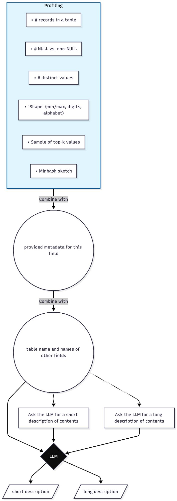
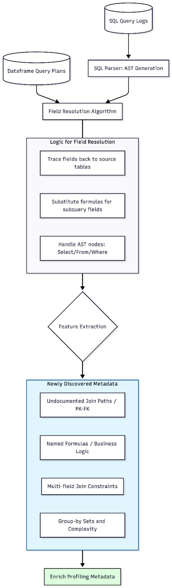
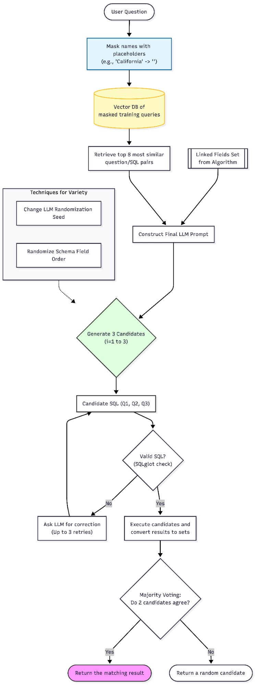
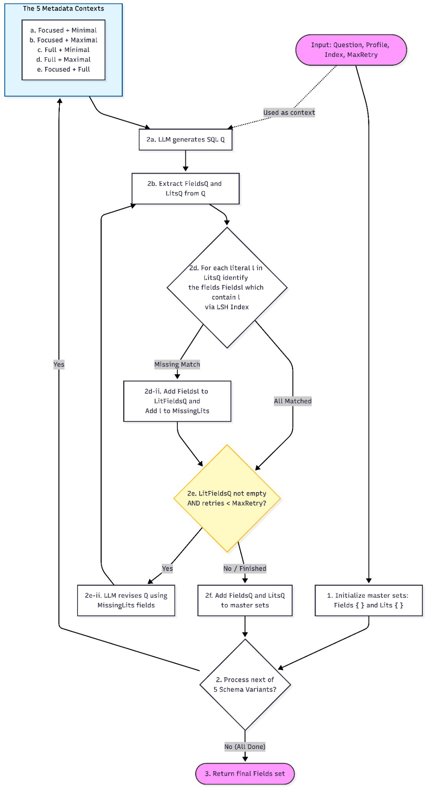
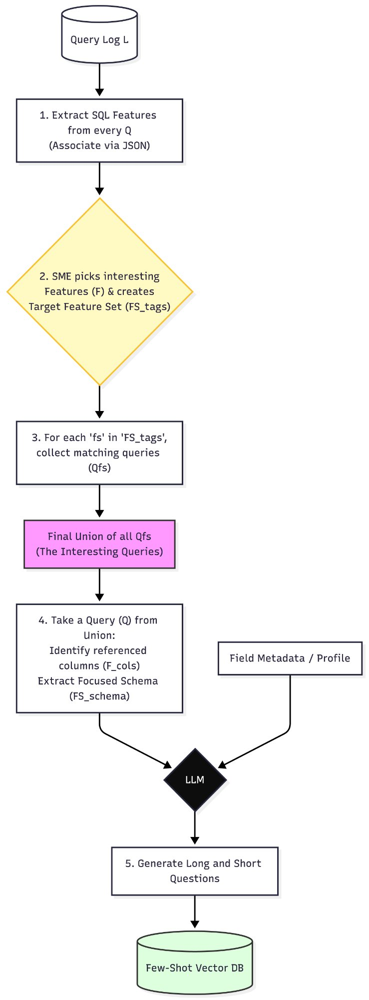

# Text-to-SQL Agent

The Text-to-SQL Agent translates Korean natural language questions into executable SQL queries against Oracle manufacturing databases. It is built on top of the "Automatic Metadata Extraction for Text-to-SQL" paper methodology, extending it with Oracle multi-database support, production-grade profiling, and a candidate voting mechanism for reliability. The pipeline runs in four sequential phases: profiling, schema linking, SQL generation and refinement (Algorithm 1), and candidate voting with majority execution.

---

## Table of Contents

1. [Architecture Overview](#architecture-overview)
2. [Phase 1 — Profiling](#phase-1--profiling)
3. [Phase 2 — Schema Linking](#phase-2--schema-linking)
4. [Phase 3 — SQL Generation and Refinement (Algorithm 1)](#phase-3--sql-generation-and-refinement-algorithm-1)
5. [Phase 4 — Candidate Generation and Voting](#phase-4--candidate-generation-and-voting)
6. [Few-Shot Store](#few-shot-store)
7. [Database Abstraction](#database-abstraction)
8. [Configuration](#configuration)
9. [Setup and Running](#setup-and-running)
10. [Testing](#testing)
11. [Project Structure](#project-structure)

---

## Architecture Overview

The full pipeline takes a natural language question and returns an executed SQL result through four sequential phases.

```
User Question
      │
      ▼
┌─────────────────────┐
│  Phase 1: Profiling │  ColumnProfiler → FieldMetadata (LLM summaries + SME enrichment)
└─────────────────────┘
      │
      ▼
┌──────────────────────────┐
│  Phase 2: Schema Linking │  FocusedSchemaBuilder (FAISS + LSH) → 5 Schema Variants
└──────────────────────────┘
      │
      ▼
┌─────────────────────────────────────────────────────┐
│  Phase 3: SQL Generation + Refinement (Algorithm 1) │  Iterative field discovery across variants
└─────────────────────────────────────────────────────┘
      │
      ▼
┌─────────────────────────────────────────────────────┐
│  Phase 4: Candidate Generation + Voting             │  3 diverse candidates → lint → execute → vote
└─────────────────────────────────────────────────────┘
      │
      ▼
  Final SQL + Result
```

**Technology stack:**

| Component | Technology |
|---|---|
| Databases | Oracle (PRIMARY_DATABASE primary, LINKED_DATABASE linked via database link) |
| LLM | Azure OpenAI (GPT-4.5-mini / GPT-4.1) |
| Semantic index | FAISS (field description embeddings) |
| Lexical index | MinHash LSH (datasketch) for literal matching |
| Few-shot vector store | FAISS + SentenceTransformers (`all-MiniLM-L6-v2`) |
| SQL parsing / validation | sqlglot |
| Config management | Pydantic Settings |

---

## Phase 1 — Profiling

Profiling is an offline phase that scans the database and builds rich metadata for every column. This metadata is the foundation for all downstream schema linking and SQL generation.

### Column profiling

`ColumnProfiler` in `profiling/statistics.py` runs against every column in the target databases and collects:

- Record count and NULL vs non-NULL counts
- Distinct value count and cardinality ratio
- Value "shape" — min/max lengths, digit/alpha ratios
- Top-k most frequent values (sampled for large columns)
- MinHash sketch for LSH literal matching

### LLM-generated field summaries



After raw statistics are collected, `profiling/summarizer.py` passes each column's profile to an LLM alongside the table name and sibling column names to generate two descriptions:

- **Short description** — one sentence, used in "minimal" schema variants to keep token count low
- **Long description** — detailed paragraph including data format, business meaning, and value patterns, used in "maximal" and "full" schema variants

Summaries are cached on disk to avoid redundant LLM calls across runs. The `FieldMetadata` object in `profiling/field_metadata.py` merges the raw profile statistics, the LLM short/long descriptions, and any human SME descriptions into a single structure passed through the rest of the pipeline.

### Query log enrichment



Existing SQL query logs can be parsed to enrich the profiling metadata with business logic that is not discoverable from schema alone. The `indexing/sql_utils.py` and SQL parser modules process historical query logs to extract:

- Undocumented join paths and PK-FK relationships
- Named formulas and business logic (computed columns, CASE expressions)
- Multi-field join constraints (composite keys)
- Group-by patterns and query complexity signatures

These discovered relationships are merged back into the profiling metadata, making the schema linking phase aware of how the database is actually queried in production rather than just what the DDL describes.

---

## Phase 2 — Schema Linking

Schema linking reduces the full database schema to only the fields relevant to a specific question. This is critical for Oracle manufacturing databases where schemas can have hundreds of tables and thousands of columns — sending the full schema to an LLM is neither practical nor accurate.

### Focused schema building

`FocusedSchemaBuilder` in `schema_linking/focused_schema.py` uses two complementary signals merged via a configurable strategy (union, intersection, FAISS-only, or LSH-only):

- **FAISS semantic search**: The question is embedded and matched against a FAISS index of field descriptions built from `FieldMetadata.full_description`. This catches semantically related fields even when question vocabulary differs from column names.
- **LSH literal matching**: Literal strings extracted from the question (entity names, values, codes) are matched against indexed column values using MinHash LSH. This catches fields where the question contains an exact or near-exact value from the database (e.g., a part number or machine code).

The schema builder is recall-oriented: it uses a threshold-based approach rather than a hard top-k limit, so it errs on the side of including relevant fields rather than excluding them.

### 5 Schema Variants

`SchemaVariantGenerator` in `schema_linking/variants.py` formats the focused schema into five distinct representations that differ in breadth and description depth:

| Variant | Schema scope | Description level |
|---|---|---|
| `focused_minimal` | Focused fields only | Short description |
| `focused_maximal` | Focused fields only | Long description |
| `focused_full` | Focused fields only | Full (SME + LLM) |
| `full_minimal` | All schema fields | Short description |
| `full_maximal` | All schema fields | Long description |

Running Algorithm 1 across all five variants ensures that fields missed by the focused schema (due to imperfect semantic or literal matching) are caught when the full schema is provided with minimal context — and that fields requiring detailed descriptions to be identified are caught in the maximal variants. The union across all variants is the final discovered field set.

---

## Phase 3 — SQL Generation and Refinement (Algorithm 1)

Algorithm 1 is the core of the schema refinement process. It runs the LLM on each of the five schema variants, checks whether the generated SQL is internally consistent with the schema, and iteratively corrects it.




### How it works

For each of the five schema variants, the runner (`sql_generation/refinement_loop.py`) performs the following loop:

**Step 1 — Generate SQL**: The LLM receives the question, the current schema variant text, and database-specific syntax instructions (Oracle date formats, `NVL`, database link syntax `@LINKED_DATABASE`, etc.) and generates a candidate SQL query.

**Step 2 — Extract Fields and Literals**: `SQLParser` in `sql_generation/sql_parser.py` uses sqlglot to parse the generated SQL into an AST and extract two sets: `FieldsQ` (the table.column references used in the query) and `LitsQ` (the literal values appearing in WHERE clauses and conditions).

**Step 3 — Literal Coverage Check**: For each literal `l` in `LitsQ`, the LSH index is queried to find the set of fields `FieldsL` that contain `l` as a value. If `FieldsL` is empty or not a subset of `FieldsQ`, the literal is "missing" — the LLM used a value from a field it didn't include in the query.

**Step 4 — Conditional Refinement**: If there are missing literals and the retry count is below `MaxRetry`, the missing fields are appended to the schema via `SchemaAugmenter` and the LLM is asked to revise the SQL with the corrected context. This loop continues until all literals are covered or `MaxRetry` is reached.

**Step 5 — Collect Fields**: The fields and literals discovered in this variant run are added to the master sets `Fields` and `Lits`.

After all five variants are processed, the final `Fields` set is the union of everything discovered across all variants and all refinement iterations. This is the reduced, relevant field set passed to Phase 4.

### Oracle-specific considerations

The agent handles cross-database queries between PRIMARY_DATABASE (primary) and LINKED_DATABASE (linked) through Oracle database links. Tables in LINKED_DATABASE are referenced as `TableName@LINKED_DATABASE` in generated SQL. The `db_specific_instructions` property in `Settings` injects the correct Oracle syntax rules into LLM prompts, covering date formatting (`TO_DATE`, `TO_CHAR`), null handling (`NVL`), string concatenation (`||`), and `SYSDATE`.

---

## Phase 4 — Candidate Generation and Voting

Once Algorithm 1 has produced the final discovered field set, Phase 4 generates multiple SQL candidates and selects the best one through execution-based voting.



The `VotingOrchestrator` in `final_sql_w_cand_voting/orchestrator.py` runs the following steps:

### Step 1 — Few-Shot Retrieval

The final discovered field set is formatted into a deterministic schema context string (`# Table (Column, Column)` format, sorted for reproducibility). This context is used to mask entity names in the question before searching the few-shot vector store, so that structural similarity (what joins and conditions are needed) drives retrieval rather than surface-level lexical overlap with specific entity names. The top-5 most similar question/SQL pairs are retrieved.

### Step 2 — Diverse Candidate Generation

`CandidateGenerator` produces `num_candidates` (default 3) SQL candidates using two diversity techniques borrowed from the "Automatic Metadata Extraction for Text-to-SQL" paper:

- **Schema field shuffling**: The field list is shuffled with a different random seed for each candidate. This exposes the LLM to different orderings of the same fields, which can surface different join strategies and column choices.
- **LLM generation seed**: Each candidate uses a different random seed, producing different token sampling paths through the LLM even with the same prompt.

The candidate generator logs a warning (but does not truncate) when the field set is unusually large, preserving recall at the cost of token count.

### Step 3 — Linting

Each candidate is passed to `SQLLinter`, which uses sqlglot to parse it and check for known anti-patterns:

- **Syntax errors**: The candidate is rejected and cannot proceed to execution.
- **NULL ordering bug**: `ORDER BY ASC LIMIT 1` without `IS NOT NULL` can silently return NULL rows instead of the minimum value.
- **String concatenation**: Preference for separate columns over concatenated strings for evaluability.

Candidates that fail the syntax check are discarded. Candidates with heuristic warnings proceed to execution with a log warning.

### Step 4 — Execution and Majority Voting

All valid candidates are executed against the live database. Results are normalized (rows converted to sorted tuples of strings) to make comparison order-independent. If two or more candidates produce identical result sets, that result wins. In case of a tie, the shortest SQL is selected as the winner (Occam's Razor). If all candidates fail execution, the first candidate is returned as a fallback.

---

## Few-Shot Store

The few-shot store (`final_sql_w_cand_voting/few_shot_store.py`) is a persistent FAISS vector index of masked question/SQL pairs used to provide in-context learning examples during SQL generation.

### Building the store

Examples are sourced from existing SQL query logs. For each query, the `QueryMasker` replaces named entities (machine codes, part numbers, date values, etc.) with generic placeholders — for example, `'California'` becomes `''`. This masking step ensures that retrieval is based on query structure rather than specific entity values, making examples reusable across questions about different entities of the same type.

Masked questions are embedded with `all-MiniLM-L6-v2` and stored in a FAISS `IndexFlatIP` index alongside the original question, masked question, SQL, and database ID. The store is persisted to disk at `data/few_shot_store/` as a FAISS index file and a JSON metadata file.

Content hashing (SHA-256) is used to deduplicate examples, so the same question/SQL pair is never indexed twice even across incremental builds.

### Retrieval

At query time, the incoming question is masked, embedded, and searched against the index. Results are filtered by `db_id` when operating in multi-database mode (relevant for BIRD benchmarking, where each question targets a specific database). The top-k examples with their original (unmasked) questions and SQL are returned for inclusion in the generation prompt.

---

## Database Abstraction

`core/database.py` provides a `BaseDatabase` abstract interface covering `get_tables()`, `get_table_info()`, `execute_query()`, and `close()`. The codebase ships with a `SQLiteDatabase` implementation for local testing and benchmarking against the BIRD dataset.

For production use against Oracle, `oracle_adapter.py` at the project root provides the Oracle implementation following the same interface. The `Settings` class handles dual-database connection management with automatic DSN rewriting for Docker environments (replacing `127.0.0.1` with `host.docker.internal`) and exposes both the `primary_connection` (PRIMARY_DATABASE) and `linked_connection` (LINKED_DATABASE) as computed properties.

The `db_type` setting (`oracle`, `postgres`, `mysql`, `sqlite`) controls both the sqlglot dialect used for SQL parsing/linting and the database-specific syntax instructions injected into LLM prompts, making the pipeline database-agnostic at the configuration level.

---

## Configuration

All settings are managed through `config/settings.py` using Pydantic Settings with `.env` file loading.

### Required environment variables

```env
# Azure OpenAI
AZURE_OPENAI_ENDPOINT=https://your-resource.openai.azure.com/
AZURE_OPENAI_KEY=...
AZURE_OPENAI_API_VERSION=2024-02-15-preview

# Primary database (PRIMARY_DATABASE)
PRIMARY_DSN=your-oracle-dsn
PRIMARY_USER=...
PRIMARY_PASSWORD=...

# Linked database (LINKED_DATABASE)
LINKED_DSN=your-oracle-dsn
LINKED_USER=...
LINKED_PASSWORD=...
```

### Key configuration parameters

| Setting | Default | Description |
|---|---|---|
| `default_model` | `gpt-4-5-mini` | Model for most LLM calls (speed-optimized) |
| `fallback_model` | `gpt-4-1` | Fallback model for complex operations |
| `db_type` | `oracle` | Database type; controls sqlglot dialect and SQL syntax instructions |
| `primary_db_name` | `PRIMARY_DATABASE` | Primary database name (non-sensitive) |
| `linked_db_name` | `LINKED_DATABASE` | Linked database name |
| `linked_suffix` | `@LINKED_DATABASE` | Database link suffix appended to cross-DB table references |
| `profile_sample_size` | `10000` | Max distinct values sampled per column for profiling |
| `profile_top_k` | `10` | Top-k most frequent values collected per column |
| `max_concurrent_requests` | `5` | Max concurrent async LLM requests |
| `use_docker` | `false` | Rewrites `127.0.0.1` to `host.docker.internal` in DSNs |

---

## Setup and Running

### Prerequisites

- Python 3.11+
- Oracle Instant Client (for production Oracle connections)
- FAISS installed via conda: `conda install -c conda-forge faiss-cpu`

### 1. Install dependencies

```bash
# Create and activate virtual environment
python -m venv venv
source venv/bin/activate  # Windows: venv\Scripts\activate

# Install Python packages
pip install -r requirements.txt

# Install FAISS via conda (must be separate — not available via pip reliably)
conda install -c conda-forge faiss-cpu
```

### 2. Configure environment

```bash
cp .env.example .env
# Edit .env with your Azure OpenAI keys and Oracle connection strings
```

### 3. Run profiling (offline, run once)

```bash
python -m profiling.run_profiling
```

This scans the connected databases, generates column statistics, and calls the LLM to produce field summaries. Results are cached on disk. Re-run only when the schema changes significantly.

### 4. Build the few-shot store (offline, run once)

```bash
python test_scripts/inspect_store.py  # Verify existing store
# Or rebuild:
python populate_store.py
```

### 5. Run the pipeline

```bash
# End-to-end pipeline example
python test_scripts/example_phase2_pipeline.py

# Full Phase 4 (orchestrator + voting)
python test_scripts/test_phase4_pipeline.py

# Oracle + Korean query test
python test_scripts/test_oracle_korean_pipeline.py
```

---

## Testing

```bash
pytest test_scripts/ -v
```

| Test file | Coverage |
|---|---|
| `test_sql_parser.py` | SQL AST parsing, field and literal extraction |
| `test_sql_parser_physical_fields.py` | Physical field resolution in parsed SQL |
| `test_schema_linking.py` | Focused schema building, variant generation |
| `test_fuzzy_matching.py` | LSH literal matching accuracy |
| `test_indexing_full.py` | Full indexing pipeline (FAISS + LSH) |
| `test_query_masker.py` | Entity masking heuristics |
| `test_phase4_pipeline.py` | End-to-end orchestrator + voting pipeline |
| `test_oracle_korean_pipeline.py` | Oracle multi-DB Korean query pipeline |
| `test_llm_client.py` | LLM client connectivity and response parsing |
| `test_comprehensive_sme.py` | SME description parsing and enrichment |
| `benchmark_latency.py` | Phase 4 latency benchmarking over BIRD questions |

---

## Project Structure

```
text_to_sql_agent/
├── core/
│   ├── llm_client.py       # BaseLLMClient interface + Azure OpenAI implementation
│   └── database.py         # BaseDatabase interface + SQLite implementation
├── config/
│   └── settings.py         # Pydantic settings (env-based, dual-DB, dialect-aware)
├── profiling/
│   ├── statistics.py       # ColumnProfiler: stats, top-k values, MinHash sketches
│   ├── summarizer.py       # LLM short/long field summaries with disk cache
│   ├── field_metadata.py   # FieldMetadata: merges profile + SME + LLM descriptions
│   └── metadata_enricher.py # Attach SME descriptions from BIRD dataset
├── indexing/
│   ├── field_index.py      # FAISS semantic index over field descriptions
│   ├── lsh_matcher.py      # Generic MinHash LSH lexical matcher
│   ├── schema_matcher.py   # SchemaLiteralMatcher adapter (LSH → schema values)
│   ├── embeddings.py       # Embedding model helpers
│   ├── shingling.py        # Token shingling for LSH
│   └── sql_utils.py        # Identifier/literal escaping helpers
├── schema_linking/
│   ├── focused_schema.py   # FocusedSchemaBuilder (FAISS + LSH merge)
│   ├── variants.py         # 5 schema variants + prompt formatting
│   ├── literal_extractor.py # Heuristic + LLM literal extraction from question
│   └── sme_parser.py       # Parse SME descriptions from BIRD dataset
├── sql_generation/
│   ├── refinement_loop.py  # Algorithm 1: iterative SQL refinement across variants
│   ├── sql_parser.py       # sqlglot AST parser: extract fields + literals from SQL
│   ├── schema_augmenter.py # Add missing literal fields to schema for revision
│   └── types.py            # Typed result dataclasses for parsing and refinement
├── final_sql_w_cand_voting/
│   ├── orchestrator.py     # VotingOrchestrator: full Phase 4 pipeline
│   ├── candidate_generator.py # Diverse SQL candidates (field shuffle + seed)
│   ├── sql_linter.py       # Heuristic SQL linter (sqlglot-based)
│   ├── few_shot_store.py   # FAISS few-shot store with masking + persistence
│   └── query_masker.py     # Entity masking for structural similarity retrieval
├── oracle_adapter.py       # Oracle database implementation (production)
├── data/
│   └── few_shot_store/     # Persisted FAISS index + JSON metadata
└── test_scripts/           # End-to-end tests and benchmarks
```
